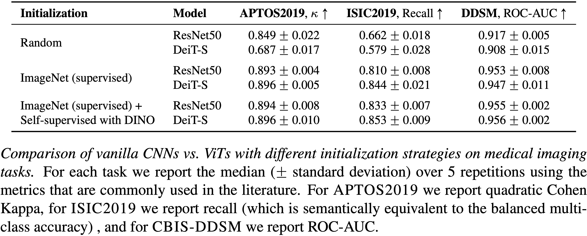

# [Is it Time to Replace CNNs with Transformers for Medical Images?](https://arxiv.org/abs/2108.09038)

***Accepted at ICCV-2021: Workshop on Computer Vision for Automated Medical Diagnosis (CVAMD)***

Convolutional Neural Networks (CNNs) have reigned for a decade as the de facto approach to automated medical image diagnosis. 
Recently, vision transformers (ViTs) have appeared as a competitive alternative to CNNs, yielding similar levels of performance while possessing several interesting properties that could prove beneficial for medical imaging tasks.
In this work, we explore whether it is time to move to transformer-based models or if we should keep working with CNNs - can we trivially switch to transformers? 
If so, what are the advantages and drawbacks of switching to ViTs for medical image diagnosis? 
We consider these questions in a series of experiments on three mainstream medical image datasets.
Our findings show that, while CNNs perform better when trained from scratch, off-the-shelf vision transformers using default hyperparameters are on par with CNNs when pretrained on ImageNet, and outperform their CNN counterparts when pretrained using self-supervision.

<p align="center">
  
</p>

## Enviroment setup
To build using the docker file use the following command \
```docker build -f Dockerfile -t med_trans \``` \
```              --build-arg UID=$(id -u) \``` \
```              --build-arg GID=$(id -g) \``` \
```              --build-arg USER=$(whoami) \``` \
```              --build-arg GROUP=$(id -g -n) .```

## Usage:
* Training: ```python classification.py```
* Training with DINO: ```python classification.py --dino```
* Testing (using json file): ```python classification.py --test```
* Testing (using saved checkpoint): ```python classification.py --checkpoint CheckpointName --test```
* Fine tune the learning rate: ```python classification.py --lr_finder```


## Configuration (json file)

* dataset_params
  * dataset: Name of the dataset (ISIC2019, APTOS2019, DDSM)
  * data_location: Location that the datasets are located
  * train_transforms: Defines the augmentations for the training set
  * val_transforms: Defines the augmentations for the validation set
  * test_transforms: Defines the augmentations for the test set
* dataloader_params: Defines the dataloader parameters (batch size, num_workers etc)
* model_params
  * backbone_type: type of the backbone model (e.g. resnet50, deit_small)
  * transformers_params: Additional hyperparameters for the transformers
    * img_size: The size of the input images
    * patch_size: The patch size to use for patching the input
    * pretrained_type: If ```supervised``` it loads ImageNet weights that come from supervised learning. If ```dino``` it loads ImageNet weights that come from sefl-supervised learning with DINO.
  * pretrained: If True, it uses ImageNet pretrained weights
  * freeze_backbone: If True, it freezes the backbone network
  * DINO: It controls the hyperparameters for when training with DINO 
* optimization_params: Defines learning rate, weight decay, learning rate schedule etc.  
  * optimizer: The default optimizer's parameters
    * type: The optimizer's type
    * autoscale_rl: If True it scales the learning rate based on the bach size
    * params: Defines the learning rate and the weght decay value
  * LARS_params: If use=True and bach size >= batch_act_thresh it uses LARS as optimizer
  * scheduler: Defines the learning rate schedule
    * type: A list of schedulers to use
    * params: Sets the hyperparameters of the optimizers
* training_params: Defines the training parameters
  * model_name: The model's name
  * val_every: Sets the frequency of the valiidation step (epochs - float)
  * log_every: Sets the frequency of the logging (iterations - int)
  * save_best_model: If True it will save the bast model based on the validation metrics
  * log_embeddings: If True it creates U-maps on each validation step
  * knn_eval: If True, during validation it will also calculate the scores based on knn evalutation
  * grad_clipping: If > 0, it clips the gradients
  * use_tensorboard: If True, it will use tensorboard for logging instead of wandb
  * use_mixed_precision: If True, it will use mixed precision 
  * save_dir: The dir to save the model's checkpoints etc.
* system_params: Defines if GPUs are used, which GPUs etc.
* log_params: Project and run name for the logger (we are using [Weights & Biases](https://www.wandb.com/) by default)
* lr_finder: Define the learning rate parameters
  * grid_search_params
    * min_pow, min_pow: The min and max power of 10 for the search
    * resolution: How many different learning rates to try
    * n_epochs: maximum epochs of the training session
    * random_lr: If True, it uses random learning rates withing the accepted range
    * keep_schedule: If True, it keeps the learning rate schedule
    * report_intermediate_steps: If True, it logs if validates throughout the training sessions
* transfer_learning_params: Turns on or off transfer learning from pretrained models
  * use_pretrained: If True, it will use a pretrained model as a backbone
  * pretrained_model_name: The pretrained model's name
  * pretrained_path: If the prerained model's dir
